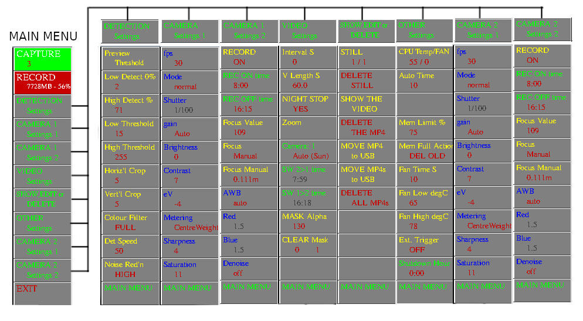
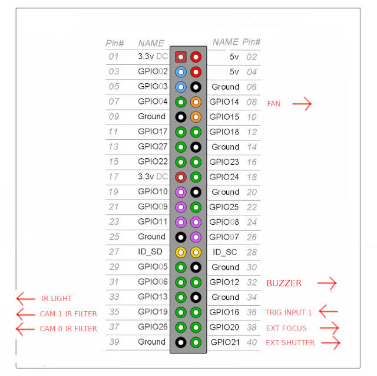
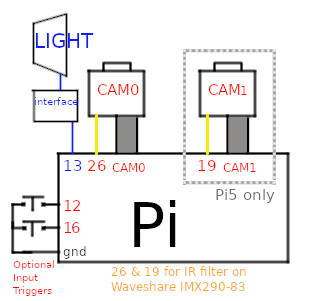

# PiVideoer3

A python script to continuously capture Videos from Pi v1,2,3 , HQ or GS cameras , Arducam OWLSIGHT or HAWKEYE 64MP AF camera, Arducam 16MP AF camera or Waveshare imx290-83 camera, still captures triggered by motion , external trigger or manually. 
Uses Raspberry OS BULLSEYE or BOOKWORM (for BOOKWORM switch to X11 not Wayland) and Picamera2.

For arducam cameras follow their installation instructions eg. https://docs.arducam.com/Raspberry-Pi-Camera/Native-camera/64MP-Hawkeye/

The waveshare imx290-83 IR filter can be switched (camera 1 connected to gpio26,pin37, camera2 connected to gpio19,pin35) based on sunrise/sunset or set times. IR light can be controlled by gpio13,pin33 (interface required). 

Pi4 or Pi5 recommended. If using the sd card as the main store use a 64gb or 128gb card, if using RAM then as much as possible but note a loss of mains 
will loose all your videos.

Set your location, and hours difference to utc time in the script.

On a Pi5 allows switching of 2 cameras based on sunrise/sunset or set times.

The idea is to put a normal camera on cam0 and a Noir camera on cam1, or a waveshare imx290-83 on cam 0 and allow it to switch the IR filter

If you only have a single camera with ir filter you could change the ir light for a normal light for night use. You can also set it to start/stop recording at sunrise/sunset or user set times.

It will capture videos at 30fps at 1280 x 720 (can be changed in the script), or on a GS camera 1456 x 1088.

## Screenshot

Pi v3, Arducam HAWKEYE, OWLSIGHT or 16MP cameras can be auto / manually focussed. Pi v3 also can do spot focus.

Makes individual MP4s, length set in script, default 5 mins (300 seconds)

Captured stills can be viewed and the video played it comes from.

Can be set to store to RAM, SD-CARD or USB drive. Set 'store' variable in the script to 0,1 or 2.

If the RAM / SD-CARD get full the action taken can be set to stop, delete oldest video or move to usb (assuming usb drive / stick attached).

Can be set to move all MP4s to usb at exit, assuming usb stick attached.

Can control focus on a pi v3camera, auto, continuous,  manual or spot. For spot click on image when in menu showing focus options.

MP4s and jpegs captured in /home/《user》/Videos. 

To install:

Install latest FULL RaspiOS based on Bookworm (tested with FULL 32bit and 64bit versions)

if using BOOKWORM switch to X11. sudo raspi-config, choose advanced , choose 6A X11 option, reboot.

sudo apt install python3-opencv

sudo pip3 install ephem --break-system-packages (or use venv!!)

Download PiVideoer3.py and copy to /home/《user》

Note buttons with RED text use right mouse click, others left click. Click on left or right part of button as appropriate.

## Menu Structure

## Connections

## Setup

